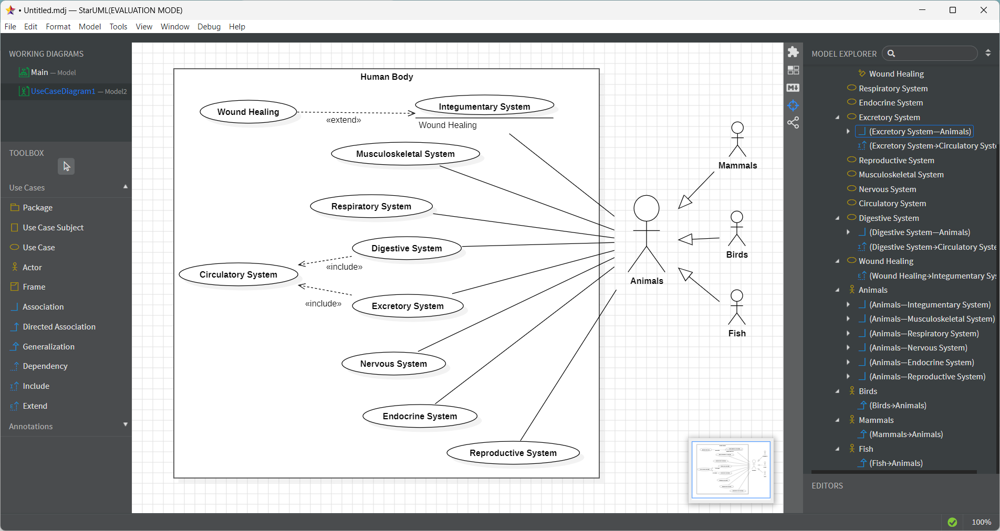

# micro-task 01
## 1. Introduction
* Based on the [decription](https://www.britannica.com/science/human-body), construct a **Use Case Diagram** that depicts the human body as organization. The actors that interact with the organization will be animals (mammals, birds, fish).

## 2. Goals
During this task, you have to accomplish (and check, accordingly) the following **goals**:
- [x] Depict system boundary.
- [x] Depict the basic use cases (not less than 3, not more than 10).
- [x] Depict actors.
- [x] Depict the relationships: associations, includes, extends, generalizations.

## 3. Image

## 4. Assumptions
* Assumption01: **I consider the actors (animals) who interact with the organization to be secondary operators.**
* Assumption02: At the includes of the circulatory system with the digestive and excretory systems, , it is "filtered" with the blood, absorbing nutrients and removing waste (toxic nitrogen compounds, carbon dioxide, etc.)
* Assumption03: Ιn the Integumentary System i added an extend for wound healing

## 5. Deadline
**Upload until**: 18-03-2025
