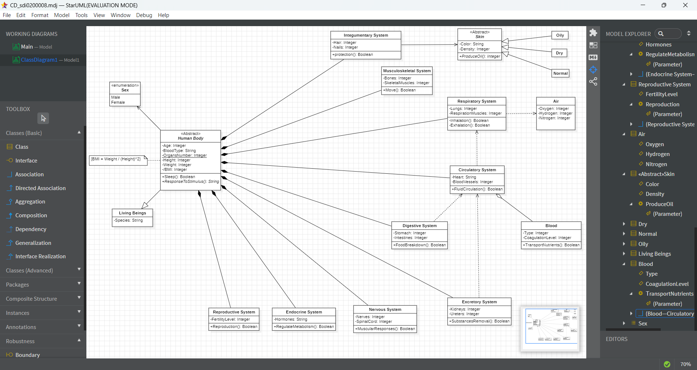

# micro-task 02
## 1. Introduction
* Based on the [decription](https://www.britannica.com/science/human-body), construct a **Class Diagram** (in folder **Sub02**) that depicts the human body as organization.
* If you cannot find all the answers you need in the description, you can make your own assumptions (see **chapter 4** below).

## 2. Goals
During this task, you have to accomplish (and check, accordingly) the following **goals**:
- [x] Depict human body as a class with at least 2 **attributes** and 2 **methods**.
- [x] Depict the basic systems of the human body as **classes** (not less than 3, not more than 10).
- [x] Depict at least one class as **Abstract** (whichever fits better to your design).
- [x] Depict the **relationships** between the classes (Aggregations and/or Compositions, Associations, Dependencies, Inheritance etc.) that better fit your diagram.
- [x] Depict at least one **enumeration**.
- [x] Depict at least one class attribute as **static** (whichever you want).

## 3. Image

## 4. Assumptions
* Assumption01: The circulatory system and blood are linked by aggregation, because one can exist independently of the other. The circulatory system uses blood but blood also exists outside of it (e.g., in a transfusion).
* Assumption02: Some class attributes, such as heart, the definition type is string, because there are also hearts, with e.g. mechanical or physical valves, etc.
* Assumption03: The dependency between the circulatory and respiratory systems is due to the circulatory system having a constant supply of oxygen that it receives from the respiratory system (through a corresponding dependence of the respiratory system and air).
* Assumption04: Τhe digestive and excretory systems that are connected to the circulatory system by dependency because both of them need/use blood for removal or absorption of substances
* Assumption05: In addition to the human body class, we defined an additional abstract class, skin. Because every person has a specific skin type (Oily, Dry, Normal), so there is no need to create an object from Skin. Finally, the classes that we associate with inheritance (i.e. Oily, Dry, Normal)  with their operations and attributes not analyzed in our diagram for brevity reasons .

## 5. Deadline
**Upload until**: 01-04-2025
