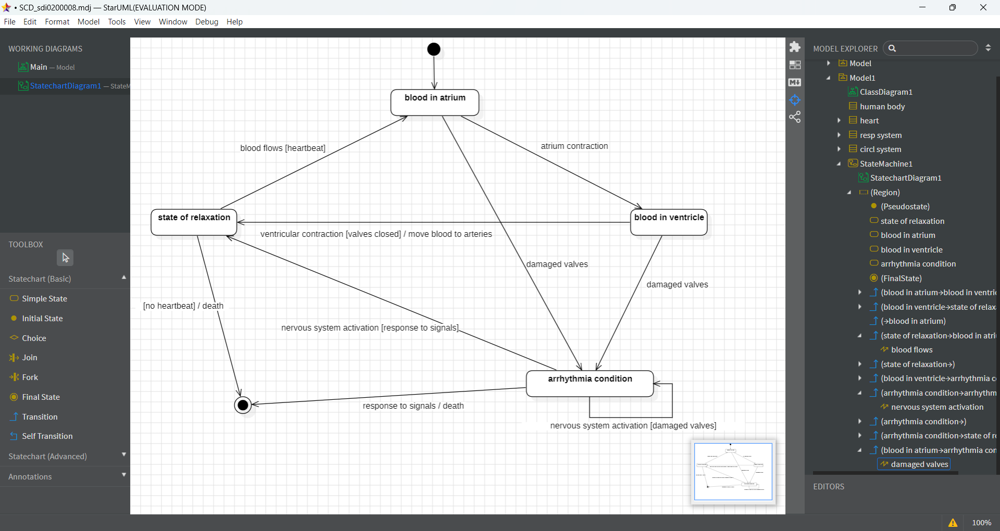

# micro-task 04
## 1. Introduction
* Based on the [description](https://www.britannica.com/science/human-body) below, construct a **Statechart Diagram** in folder **Sub04**. You should choose a class from your Class Diagram and depict all the states of its instance.

## 2. Goals
During this task, you have to accomplish (and check, accordingly) at least the following **requirements**:
- [x] Depict at least 3 states in your diagram.
- [x] Depict all the necessary triggers, guards, and activities (at least one of each).

## 3. Image

## 4. Assumptions
* Assumption01: In this diagram, I chose the circulatory system from Class Diagram, specifically depict all the states for the function of the heart.
* Assumption02: At some points I use the same sentence for a guard or a trigger (e.g., damaged valves) but they have a different purpose. Specifically, a trigger is about triggering an event, while a guard is about monitoring a situation.

## 5. Deadline
**Upload until**: 28-04-2025
