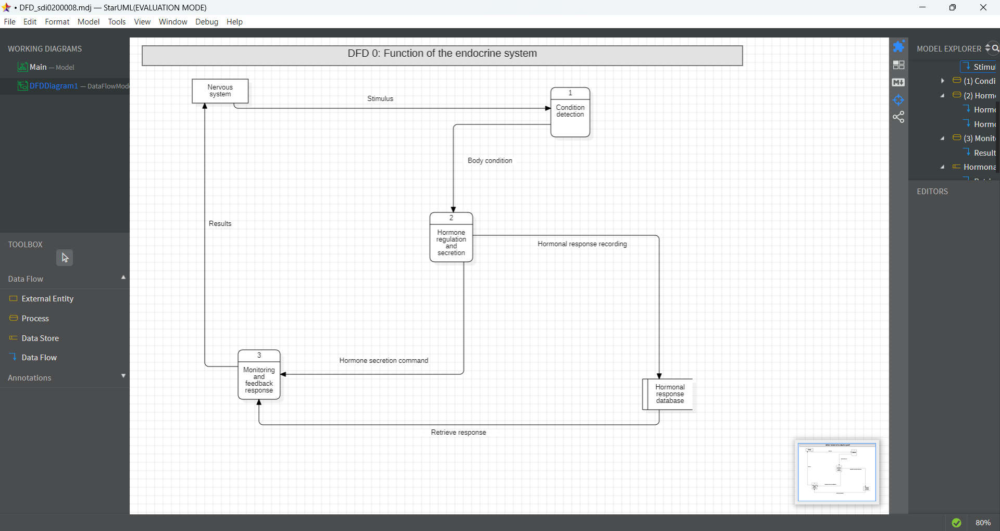

# micro-task 05
## 1. Introduction
* Based on the [description](https://www.britannica.com/science/human-body), select a subsystem of your choice and construct an 1-Level **Data Flow Diagram** in folder **Sub05**.
* If you cannot find all the answers you need in the description, you can make your own assumptions (see **chapter 4** below).

## 2. Goals
During this task, you have to accomplish (and check, accordingly) at least the following **requirements**:
- [x] Depict at least 3 processes in your diagram.
- [x] Depict at least 1 external entity in your diagram.
- [x] Depict at least 1 data store in your diagram.
- [x] Depict all the necessary flows.

## 3. Image

## 4. Assumptions
* Assumption01: ................
* Assumption02: ................
* ...

## 5. Deadline
**Upload until**: 11-05-2025
